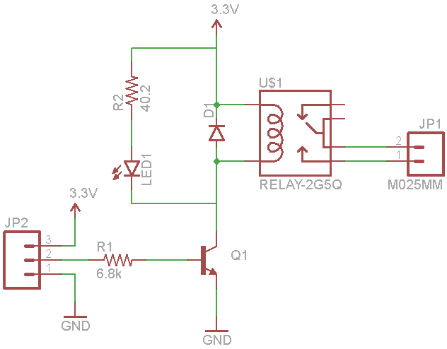
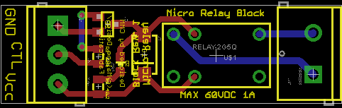
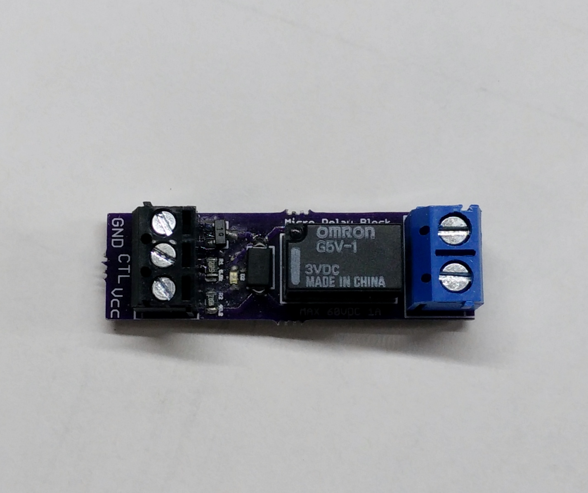

# Micro Relay Block

This a simple carrier board for a micro relay used to switch a high voltage DC load with a microcontroller. The board was designed for use with an Omron G5V-1 relay which allows switching control of loads up to 60V and 1A from a 3.3V controller. 

## Schematic

The relay coil is switched using a NPN transistor. When the load is switched on, the an LED indicates the relay is active.

## PCB

The board was designed in EAGLE and fabricated by [Oshpark](http://oshpark.com).

